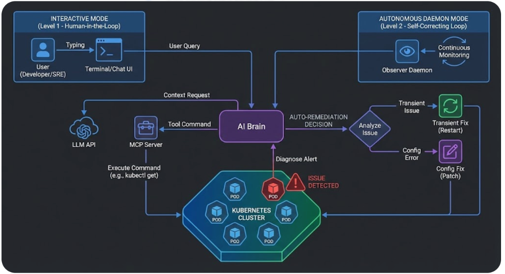
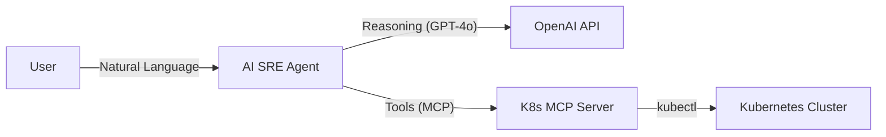
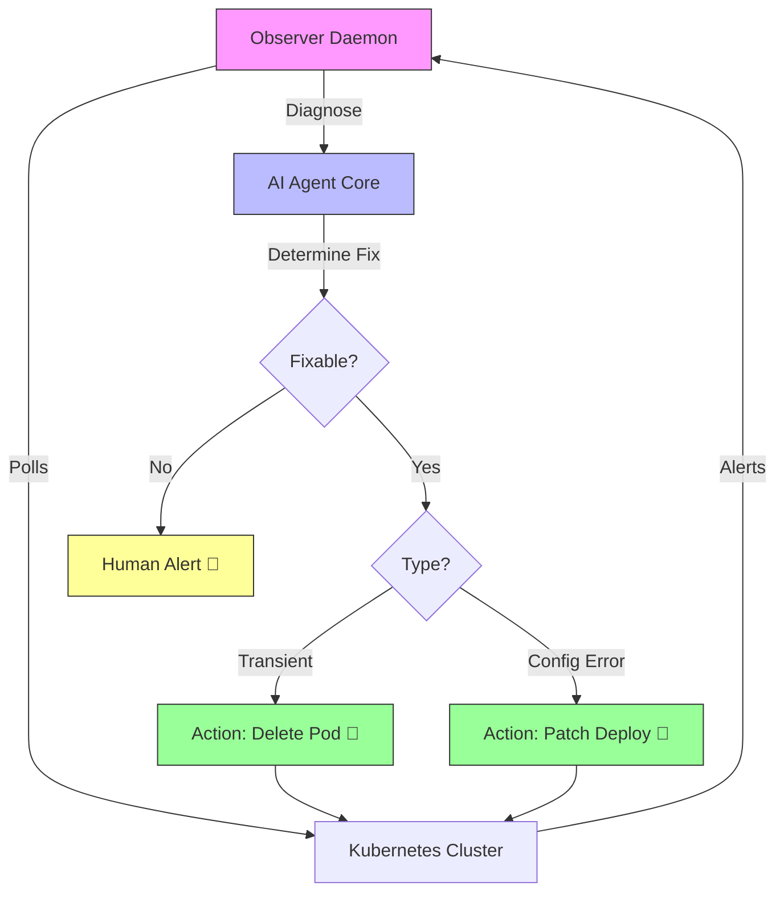

# 🤖 AI SRE Agent

> **Your Autonomous Site Reliability Engineer, powered by GPT-4o & Model Context Protocol (MCP)**

[](https://opensource.org/licenses/MIT)
[](https://python.org)
[](https://kubernetes.io/)

The **AI SRE Agent** is a next-generation operational tool that bridges the gap between natural language intent and Kubernetes execution. It doesn't just run commands; it understands your cluster, diagnoses issues, and performs complex orchestrations safely.

## ✨ Capabilities

*   **🗣️ Natural Language Ops**: Interact with your cluster using plain English (e.g., *"Scale the payments deployment to handle high load"*).
*   **🩺 Deep Diagnostics**: Automatically correlates logs, events, and pod status to diagnose CrashLoopBackOffs or networking issues.
*   **🛠️ MCP Integration**: Built on the [Model Context Protocol](https://modelcontextprotocol.io/), allowing extensible tool use.
*   **🛡️ Safety Guardrails**: Prompts for confirmation before executing destructive actions like deletions or scaling to zero.
*   **🔄 Auto-Healing Patterns**: Can identify and restart failing resources autonomously (with permission).

## 🚀 Quick Start

### Prerequisites
*   Python 3.11+ (Required for `mcp` SDK)
*   Node.js & npm (for the MCP server)
*   A running Kubernetes cluster (Minikube, Kind, GKE, EKS, etc.)
*   `kubectl` configured locally

### Installation

1.  **Clone the repository**
    ```bash
    git clone https://github.com/yourusername/ai-sre-agent.git
    cd ai-sre-agent
    ```

2.  **Run Setup Script**
    This handles Python 3.11, virtual environment, and dependencies automatically.
    ```bash
    ./setup.sh
    ```

3.  **Activate Environment**
    ```bash
    source .venv/bin/activate
    ```

3.  **Install MCP Server**
    ```bash
    npm install kubernetes-mcp-server
    ```

4.  **Configuration**
    Create a `.env` file from the template:
    ```bash
    cp .env.example .env
    ```
    Edit `.env` and add your OpenAI API Key:
    ```ini
    OPENAI_API_KEY=sk-...
    MODEL_NAME=gpt-4o  # Optional, defaults to gpt-4o
    ```

### Usage

**Interactive Mode (Chat)**
Start a session with your AI SRE:
```bash
python main.py interact
```

**Single Command Mode**
Run a specific task and exit:
```bash
python main.py run "List all pods that have restarted more than 5 times"
```

## 💡 Real-World Examples

| Scenario | User Query | Agent Action |
|----------|------------|--------------|
| **Incident Response** | "Why is `order-service` failing?" | Checks pod status, fetches logs, analyzes stack trace, identifies DB connection timeout. |
| **Cost Optimization** | "Find unused namespaces." | Lists namespaces, checks for active pods/services, recommends deletion for empty ones. |
| **Deployment** | "Deploy Redis with 3 replicas." | Generates valid StatefulSet YAML, verifies syntax, applies to cluster. |
| **Troubleshooting** | "Explain the events for pod X." | Fetches K8s events, correlates with timestamps, explains the failure in plain English. |

## 🏗️ Architecture



### 1. Level 1: Interactive Chat
The standard mode where the user asks questions and the agent responds.



### 2. Level 3: Protocol for Self-Correction (Auto-Fix)
The **Daemon Mode** runs in the background. It not only identifies issues but actively corrects them (Restarting pods or Patching configs).



*   **Core Engine**: `src/core/agent.py` - Manages conversation state and tool execution loop.
*   **Protocol**: Uses `stdio` to communicate with the `kubernetes-mcp-server` toolset.


## 🔮 Future Roadmap

We are building towards a fully autonomous **Level 4 SRE Agent** that can self-heal and optimize clusters without human intervention.

👉 **[Read our detailed Future Vision & Roadmap here](FUTURE_VISION.md)**

## 🤝 Contributing

Contributions are welcome! Please feel free to submit a Pull Request.

## ⚠️ Disclaimer

This tool executes real commands against your Kubernetes cluster. While it includes safety prompts, **always verify destructive commands** before confirming. Use with caution in production environments.
